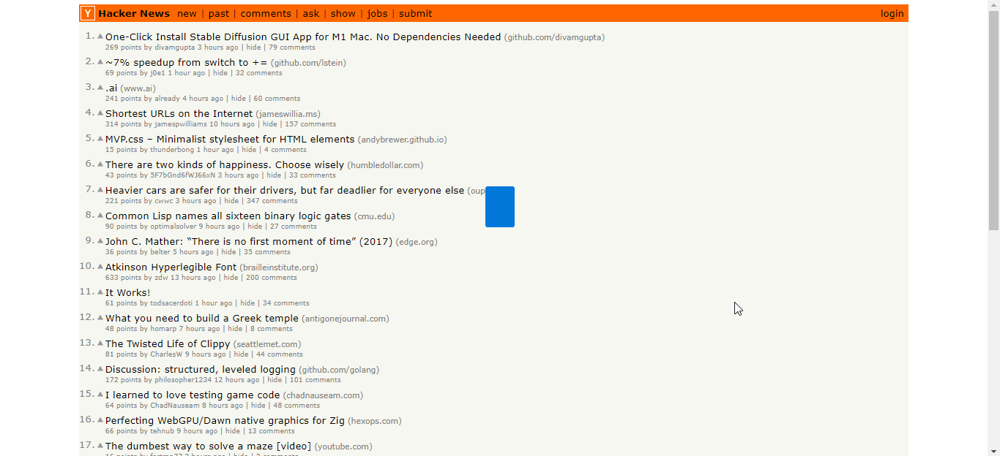

<h1 align="center">
  <b>Karaoke Reminder</b>
   
   
  
</h1>

<h2 align="center"><i>Keep your priorities in order with this obnoxious overlay that doesn't go away!</i></h2>

## About

Made for [this r/SomebodyMakeThis post](https://old.reddit.com/r/SomebodyMakeThis/comments/wuy5xt/think_need_to_hire_someone_for_this/)

## Usage 

- mouse wheel scroll up (next) or down (previous)

- text is always active like a textbox, so just click to focus and then type

- right click to access context menu, for common commands like copy & paste, and also change background to GIF

- right click tray icon to access about popup, or to exit the program

- <kbd>Enter</kbd> to add a new text

- <kbd>Backspace</kbd> the whole text to delete it (unless it's the only one remaining)

## Preview

<h1 align="center">
  </a>  

  <a href="https://girkovarpa.itch.io/unofficial-sciter-template#download">
  👉 Download for Windows 👈</a>
</h1>
